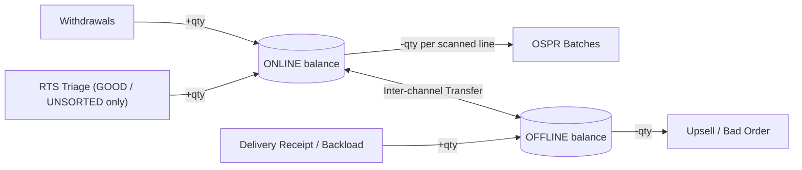

# System Workflows

How stock actually moves through this system, organized by the two channels
the whole data model is built around: **ONLINE** (Production → Packing →
e-commerce shop) and **OFFLINE** (warehouse / physical retail distribution).
Every balance lives in `channel_inventory`, keyed by `(product_id, unit_id,
channel)` — every workflow below is really just "what adjusts that number,
and by how much."

(`RTS Triage` entries categorized `LEAK`/`BAD_ORDER` are write-offs — logged
for reporting but deliberately left out of this balance flow; see 1.3.)

---

## Part 1 — ONLINE (Production → Packing → E-commerce)

### 1.1 Withdrawals — stock enters the ONLINE channel
1. Production finishes a run of a product/unit and hands it to Packing.
2. A Packer logs a **Withdrawal**: shift (AM/PM), packer, product, unit, quantity.
3. `POST /api/withdrawals` inserts the row and calls
   `ChannelInventory::adjust(..., 'ONLINE', +quantity)` in one transaction.
4. This is the *only* normal way ONLINE stock increases from production (as
   opposed to a return or an inter-channel transfer bringing stock in).

### 1.2 OSPR Batches — stock leaves the ONLINE channel to fulfill orders
1. A Packer **opens a batch** for the day (`POST /api/ospr/batches`) —
   date, preparer, courier.
2. For each customer order, they **scan/add a line** to the open batch
   (`POST /api/ospr/items`): code name, product, unit, quantity, customer
   name. Each line immediately decrements ONLINE
   (`ChannelInventory::adjust(..., 'ONLINE', -quantity)`) inside a
   transaction that also re-checks the batch is still `OPEN` (`FOR UPDATE`),
   so a line can't be added to a batch someone just closed.
3. A line can be removed while the batch is still open
   (`DELETE /api/ospr/items`) — this reverses the ONLINE decrement the
   line made and re-checks the batch is still `OPEN` (`FOR UPDATE`), same
   as the Delivery Receipt manifest case in 2.2. (Previously a known gap:
   removal used to leave the decrement in place - fixed.)
4. When packing is done, the batch is **closed**
   (`POST /api/ospr/close`): sets `packed_by`/`time_ended`, and
   auto-computes the Accomplishment Report (total pieces, total parcels,
   quantity per unit) straight from the logged lines — nothing is
   hand-added-up. Optional per-packer box counts can be submitted at the
   same time.

### 1.3 RTS Triage — returns come back into (or are written off from) ONLINE
1. A return arrives. Staff log it (`POST /api/rts-triage`): product, unit,
   quantity, and a category — `UNSORTED` (default, "not triaged yet"),
   `GOOD`, `LEAK`, or `BAD_ORDER`.
2. **Only `GOOD` and `UNSORTED` restock ONLINE.** `LEAK` and `BAD_ORDER` are
   write-offs: logged for reporting, but `channel_inventory` is left
   untouched, so a damaged return never re-enters sellable stock. (This
   branch was the one confirmed bug fix in this system so far — earlier,
   every category restocked identically.)
3. Every return, restocking or not, still counts toward that date's RTS
   total in the fulfillment rollup (below) — write-offs aren't hidden from
   reporting, only from resale.

### 1.4 Daily Fulfillment Summary — read-only report over 1.2 and 1.3
1. `GET /api/fulfillment-daily?date=` computes, live, per product/unit:
   `qty_out` = sum of that date's OSPR order-item quantities (1.2), and
   `qty_rts` = sum of that date's RTS quantities regardless of category
   (1.3) — both queried straight from source, not from a separately
   maintained running total.
2. Nothing here is hand-typed; there's no entry form, only a display.
3. `POST /api/fulfillment-daily` recomputes the same rollup and **snapshots**
   it into `fulfillment_daily`/`fulfillment_daily_items` for the record —
   an explicit "Save snapshot for this date" action, not a required step.

---

## Part 2 — OFFLINE (Warehouse / physical retail distribution)

### 2.1 Quick logistics log — the four flat transaction types
`POST /api/logistics` with a `type`, applied to OFFLINE in one transaction:

| Type | Effect on OFFLINE balance |
|---|---|
| `DELIVERY_RECEIPT` | + quantity (stock arriving from a supplier) |
| `BACKLOAD` | + quantity (unsold stock coming back from the field) |
| `UPSELL` | − quantity (sold directly out of the warehouse) |
| `BAD_ORDER` | − quantity (damaged/rejected stock leaving the ledger) |

Before inserting, the same `reference` (waybill/DR no.) + `type` combination
is checked against history; a repeat returns `409 duplicate_reference`
instead of silently double-logging, resolvable by resubmitting with
`"confirm_duplicate": true`.

### 2.2 Delivery Receipt manifests — the multi-SKU version of a receipt
A single flat `DELIVERY_RECEIPT` row per SKU doesn't scale to "a truck
just arrived with 15 different products on one waybill." The manifest flow:
1. **Open a receipt** (`POST /api/logistics/receipts`): one reference,
   supplier, received-by — same duplicate-reference guard as 2.1, keyed on
   the receipt's `reference`.
2. **Scan/add a line per SKU** (`POST /api/logistics/receipts/items`):
   product, unit, quantity — each line increments OFFLINE immediately,
   inside a transaction that confirms the receipt is still `OPEN`.
   Product lookup can be done by camera barcode scan
   (`GET /api/products/lookup?barcode=`) instead of a dropdown.
3. A line can be **removed** while open (`DELETE .../items`) — and unlike
   the OSPR case above, this *does* correctly reverse the OFFLINE increment.
4. **Close the receipt** (`POST /api/logistics/receipts/close`) locks it —
   no further lines can be added or removed.

### 2.3 Working with a flaky connection
The Logistics Log and Delivery Receipt pages (only these — not
Withdrawals/OSPR/RTS/Transfers) queue their writes locally when a request
can't reach the server at all:
1. A write is attempted normally first.
2. If it fails with a genuine network error (no HTTP response reached at
   all — not a validation error, not a 409), it's saved to IndexedDB
   instead of failing outright.
3. It replays automatically when the browser fires `online`, or the next
   time the app is opened — **not** from a fully closed tab in the
   background.
4. A banner shows the live pending count, and separately flags anything
   that failed to sync on replay (e.g. a receipt someone else already
   closed while this one was queued) so nothing silently vanishes.
5. The product/unit picker data itself is cached (service worker,
   `StaleWhileRevalidate`) so the *form* still works offline — only the
   barcode *lookup* call needs a live connection to resolve.

---

## Cross-channel — Inter-channel Transfers

The only sanctioned way stock moves *between* ONLINE and OFFLINE:
1. Request a transfer (`POST /api/transfers`): product, unit, source
   channel, destination channel, quantity, reason code.
2. Source balance is validated first — insufficient stock is rejected
   before anything is written.
3. Quantity **≥ 200** → status `PENDING_APPROVAL`, no balance change yet.
   Below that → status `CLEARED` immediately, and both channels are
   adjusted atomically (source −qty, destination +qty) in the same
   transaction as the insert.
4. A pending transfer can be **approved** (`PUT /api/transfers`) by an
   admin, which applies the same atomic adjustment at that point.
5. Every transfer, cleared or pending, is an immutable ledger row —
   nothing here is ever edited or deleted, only appended and (for pending
   ones) approved.

---

## Supporting processes (touch both channels)

- **Login** — username/password against `users`, no session timeout, no
  role enforcement on writes yet (a known gap — `users.role` exists in the
  schema but nothing currently checks it server-side).
- **Product catalog** — add or edit products, each with a required unique
  SKU, flag which units they carry, assign a barcode (unique when set) for
  the scan-to-select flow used in 2.2/2.1. Creating a product seeds
  `channel_inventory` rows at 0 for both channels; editing can only *add*
  units to a product, not remove one, since a unit's `channel_inventory`
  row isn't cleaned up by dropping the `product_units` link (it would
  orphan any existing balance). Also supports CSV export (full catalog)
  and CSV import (upserts by SKU: a matching SKU updates
  name/category/barcode and adds any new units listed; an unmatched SKU
  inserts a new product) via `GET/POST /api/products/export|import`.
- **Packing quota** — packers log packs against their shift
  (`POST /api/pack-logs`: packer, shift, product, unit/SKU, quantity),
  tracked against a per-packer quota (`packers.daily_quota`, defaults to
  85/shift). `GET /api/pack-logs/quota-summary?date=&shift=` rolls this up
  per packer — total packed, remaining, quota met y/n, and a
  product/SKU breakdown. Deliberately independent of `channel_inventory` —
  it's a performance/quota log layered over the existing withdrawal/OSPR
  flow, not another source of truth for stock.
- **Stock alerts** — any `channel_inventory` row at or below its
  `low_stock_threshold`, either channel, surfaced on the Dashboard.
- **Audit trail** — every write above logs an append-only row
  (action, entity, entity id, details) — the reconciliation record if a
  balance ever looks wrong.
- **Log books** — two read-only views over the same underlying data: by
  SKU (withdrawn vs. packed) and by packer (withdrawn, boxes packed,
  batches packed).
